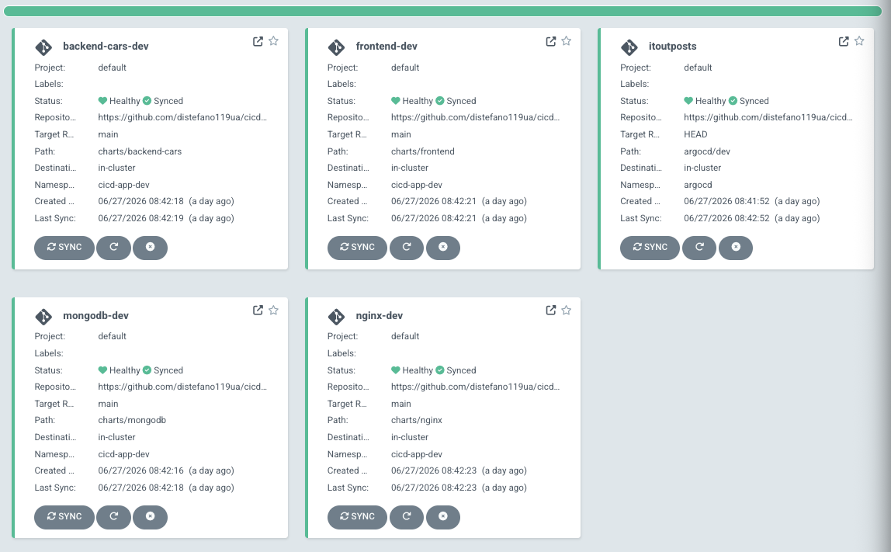

Завдання 1. Порівняти ArgoCD та FluxCD

# ArgoCD vs FluxCD — Порівняння GitOps інструментів

## Як працює ArgoCD

ArgoCD — це декларативний GitOps інструмент з централізованою архітектурою. Один ArgoCD сервер розгорнутий в кластері і виступає центром управління — він підключається до Git репозиторію, порівнює бажаний стан (те що в Git) з поточним станом кластера і автоматично синхронізує розбіжності.

ArgoCD працює за моделлю **hub-and-spoke** — один центральний інстанс може керувати деплоями на кілька кластерів одночасно. При кожному циклі reconciliation ArgoCD:

1. Читає маніфести з Git репозиторію
2. Порівнює з живим станом кластера
3. Якщо є розбіжність — синхронізує (автоматично або вручну)
4. Зберігає історію синхронізацій та дозволяє робити rollback

---

## Як працює FluxCD

FluxCD — це набір незалежних контролерів (GitRepository, Kustomization, HelmRelease, ImageAutomation) які працюють разом через Kubernetes API. На відміну від ArgoCD, Flux встановлюється **в кожен кластер окремо** і кожен кластер самостійно тягне зміни з Git.

Flux працює за моделлю **distributed agents** — кожен кластер автономний і незалежний. При кожному циклі reconciliation Flux:

1. Читає маніфести з Git репозиторію через GitRepository контролер
2. Застосовує зміни через Kustomization або HelmRelease контролер
3. Image automation контролер слідкує за registry і оновлює Git при появі нових образів

---

## Підхід до GitOps

| | ArgoCD | FluxCD |
|---|---|---|
| Архітектура | Централізована (hub-and-spoke) | Розподілена (per-cluster agents) |
| Reconciliation | Pull з центрального сервера | Pull з кожного кластера окремо |
| Multi-cluster | Один інстанс керує кількома кластерами | Окремий Flux в кожному кластері |
| Secret management | Інтеграція з Sealed Secrets, Vault | Нативна підтримка SOPS та Sealed Secrets |
| Image automation | Через окремий компонент argocd-image-updater | Вбудований ImageAutomation контролер |

---

## Плюси та мінуси

### ArgoCD

**Плюси:**
- Потужний веб UI з візуалізацією resource tree, diff view, sync history та логів
- Вбудований RBAC з UI інтеграцією — гнучке розмежування доступу між командами
- Простіший multi-cluster менеджмент через один центральний інстанс
- ApplicationSet для динамічної генерації Applications
- Легший онбординг для розробників і нетехнічних користувачів
- App of Apps патерн для декларативного керування всіма Applications

**Мінуси:**
- Централізований сервер — єдина точка відмови
- Більший security footprint — відкритий UI може бути вектором атаки
- Image automation потребує окремого компонента (argocd-image-updater)
- Складніший при масштабуванні на сотні кластерів

---

### FluxCD

**Плюси:**
- Легковісний і модульний — встановлюєш тільки потрібні контролери
- Більш безпечний за замовчуванням — немає централізованого UI як потенційного вектора атаки
- Вбудований Image Automation без додаткових компонентів
- Нативна інтеграція з SOPS для шифрування секретів
- Resilient архітектура — кожен кластер автономний
- Unix philosophy — кожен контролер робить одну річ добре
Завдання 1. Порівняти ArgoCD та FluxCD

# ArgoCD vs FluxCD — Порівняння GitOps інструментів

## Як працює ArgoCD

ArgoCD — це декларативний GitOps інструмент з централізованою архітектурою. Один ArgoCD сервер розгорнутий в кластері і виступає центром управління — він підключається до Git репозиторію, порівнює бажаний стан (те що в Git) з поточним станом кластера і автоматично синхронізує розбіжності.

ArgoCD працює за моделлю **hub-and-spoke** — один центральний інстанс може керувати деплоями на кілька кластерів одночасно. При кожному циклі reconciliation ArgoCD:

1. Читає маніфести з Git репозиторію
2. Порівнює з живим станом кластера
3. Якщо є розбіжність — синхронізує (автоматично або вручну)
4. Зберігає історію синхронізацій та дозволяє робити rollback

---

## Як працює FluxCD

FluxCD — це набір незалежних контролерів (GitRepository, Kustomization, HelmRelease, ImageAutomation) які працюють разом через Kubernetes API. На відміну від ArgoCD, Flux встановлюється **в кожен кластер окремо** і кожен кластер самостійно тягне зміни з Git.

Flux працює за моделлю **distributed agents** — кожен кластер автономний і незалежний. При кожному циклі reconciliation Flux:

1. Читає маніфести з Git репозиторію через GitRepository контролер
2. Застосовує зміни через Kustomization або HelmRelease контролер
3. Image automation контролер слідкує за registry і оновлює Git при появі нових образів

---

## Підхід до GitOps

| | ArgoCD | FluxCD |
|---|---|---|
| Архітектура | Централізована (hub-and-spoke) | Розподілена (per-cluster agents) |
| Reconciliation | Pull з центрального сервера | Pull з кожного кластера окремо |
| Multi-cluster | Один інстанс керує кількома кластерами | Окремий Flux в кожному кластері |
| Secret management | Інтеграція з Sealed Secrets, Vault | Нативна підтримка SOPS та Sealed Secrets |
| Image automation | Через окремий компонент argocd-image-updater | Вбудований ImageAutomation контролер |

---

## Плюси та мінуси

### ArgoCD

**Плюси:**
- Потужний веб UI з візуалізацією resource tree, diff view, sync history та логів
- Вбудований RBAC з UI інтеграцією — гнучке розмежування доступу між командами
- Простіший multi-cluster менеджмент через один центральний інстанс
- ApplicationSet для динамічної генерації Applications
- Легший онбординг для розробників і нетехнічних користувачів
- App of Apps патерн для декларативного керування всіма Applications

**Мінуси:**
- Централізований сервер — єдина точка відмови
- Більший security footprint — відкритий UI може бути вектором атаки
- Image automation потребує окремого компонента (argocd-image-updater)
- Складніший при масштабуванні на сотні кластерів

---

### FluxCD

**Плюси:**
- Легковісний і модульний — встановлюєш тільки потрібні контролери
- Більш безпечний за замовчуванням — немає централізованого UI як потенційного вектора атаки
- Вбудований Image Automation без додаткових компонентів
- Нативна інтеграція з SOPS для шифрування секретів
- Resilient архітектура — кожен кластер автономний
- Unix philosophy — кожен контролер робить одну річ добре

**Мінуси:**
- Немає вбудованого UI — потрібні Grafana дашборди або CLI для моніторингу
- Складніший онбординг для розробників
- Multi-cluster вимагає більше початкового налаштування
- Менша видимість стану деплоїв без додаткових інструментів

---

## UI порівняння

**ArgoCD** має повнофункціональний веб UI з коробки:
- Візуалізація resource tree (Deployment → ReplicaSet → Pod)
- Diff view між бажаним і живим станом
- Sync history та можливість rollback через UI
- Live логи подів прямо в браузері
- RBAC управління через UI

**FluxCD** не має UI за замовчуванням. Для базової видимості потрібно:
- `flux` CLI для перевірки стану
- Weave GitOps (open source UI від творців Flux) як окремий компонент
- Grafana дашборди з Prometheus метриками

---

## Обраний інструмент

Для виконання завдання обрано **ArgoCD** з наступних причин:

1. **Простота старту** — зрозумілий UI дозволяє швидко побачити стан всіх ресурсів і налагодити деплой без CLI гімнастики
2. **Видимість** — resource tree, diff view і sync history критично важливі при розробці та налагодженні чарту
3. **App of Apps патерн** — дозволяє декларативно керувати всіма ArgoCD Applications через Git
4. **Helm підтримка** — нативна інтеграція з Helm charts без додаткових налаштувань
5. **RBAC** — вбудована система розмежування доступу з UI інтеграцією
6. **Екосистема** — argocd-image-updater дозволяє автоматизувати оновлення образів в рамках GitOps flow

---

## Тепер все разом: CI + CD

До цього було завдання, де має бути CI workflow і для цього я зробив окремий репозиторій, як має бути в нормальній розробці. Посилання до [репозиторію](https://github.com/distefano119ua/cicd-app)

Встановити GitOps-інструмент у Kubernetes

```
dimitr@k8s-master:~$ kubectl get pods -n argocd
NAME                                                READY   STATUS    RESTARTS      AGE
argocd-application-controller-0                     1/1     Running   2 (13m ago)   5d22h
argocd-applicationset-controller-78d66cfd5b-pcsjr   1/1     Running   2 (13m ago)   5d22h
argocd-dex-server-795b9b7569-gcqpw                  1/1     Running   2 (13m ago)   5d22h
argocd-notifications-controller-85db9b54dd-lk5dv    1/1     Running   2 (13m ago)   5d22h
argocd-redis-5c7789bdf-ldbwl                        1/1     Running   2 (13m ago)   5d22h
argocd-repo-server-7fc45d4895-xkn68                 1/1     Running   2 (13m ago)   4d19h
argocd-server-78bf4dfbcb-vnjnz                      1/1     Running   2 (13m ago)   5d22h
```

Як виглядає рішення в Argocd:



На скріншоті можете помітити **itoutposts**, який знаходиться в іншому `namespace`: `argocd`, як саме наш CD інстурмент ArgoCD - це **App of Apps**. [Він](./argocd/cicd-app-dev-root.yaml) відповідальний за всі частини нашого застосунку, які запускає автоматично, а не кожну частину окремо руцями!

Додатково нагадаю, що моє рішення має запускатися в певному порядку:

`mongodb ---> backend-cars ---> frontend ---> nginx`

Тому було додано в кожний [app](./argocd/dev/) наступне налаштування:
```YAML
annotations:
  argocd.argoproj.io/sync-wave: "<int>"
```